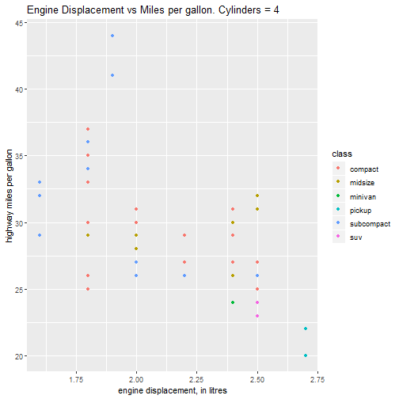

Developing Data Products Presentation
========================================================
author: Gabriel Navarro Mingorance
date: 08/02/2020
autosize: true

URL: https://gabimingorance.shinyapps.io/myshinyproject/

Shiny App description
========================================================

Simple filtering by number of cylinders on a set of cars.
The filtering can be done though a simple slider.

The resulting graph represents the Engine Displacement vs Miles per gallon.
The number of cylinders is also displayed in the graph server for the sake of clarity.

files:

- UI.R
- Server.R


UI.R
========================================================

The UI code just contains a slider definition as follows,

```r
    # Sidebar with a slider input for number of bins
    sidebarLayout(
        sidebarPanel(
            sliderInput("cylinders",
                        "Number of Cylinders:",
                        min = 4,
                        max = 8, step = 2,
                        value = 6)
        ),

        # Show a plot of the generated distribution
        mainPanel(
            plotOutput("distPlot")
        )
    )
```

Server.R
========================================================

The Server code just contains a slider definition as follows,

```r
        mtcarsfiltered <- mtcars[mtcars$cyl == input$cylinders,]
        mpg <- mpg[mpg$cyl == input$cylinders,] 
        title <- paste("Engine Displacement vs Miles per gallon. Cylinders =",
                       input$cylinders)
        
        ggplot(mpg, aes(mpg$displ, mpg$hwy, 
                                       colour = class)) + 
            geom_point() +
            scale_size_area() + 
            xlab("engine displacement, in litres") +
            ylab("highway miles per gallon") +
            ggtitle(title)

        # Show a plot of the generated distribution
        mainPanel(
            plotOutput("distPlot")
        )
    )
```


Expected results for 4 cylinders (example)
========================================================

